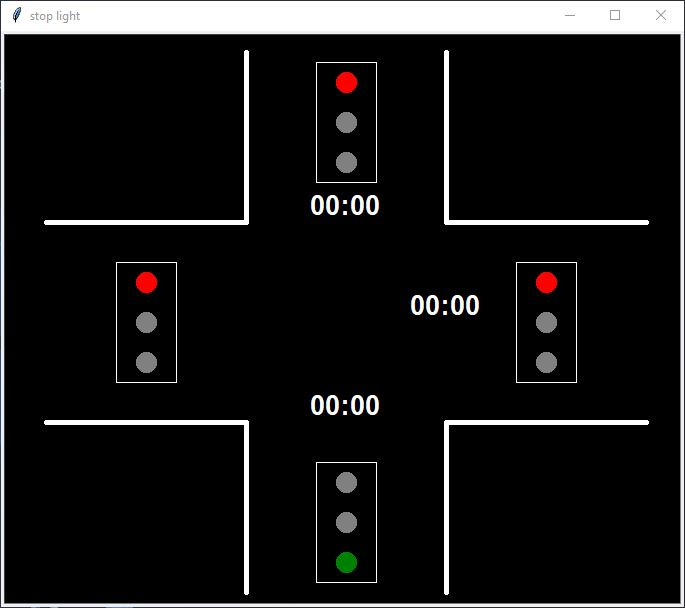
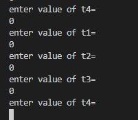
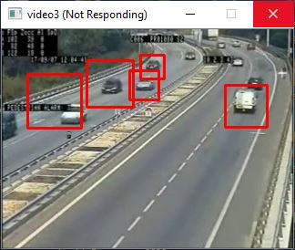
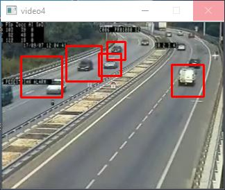

# Adaptive-Traffic-Light-Control

"This is a college project"

## OBJECTIVES OF THE PROJECT 

1.To eliminate the delay on roads by reducing traffic and controlling the signals automatically by monitoring real time vehicle density using video processing.

2.To provide security surveillance at road intersections.

3.To have virtual display of control system

## timerturtle.py

In this python program we are going to see the virtula display of out traffic light control system. We have used turtel to create the the graphics.

In this graphics, real time timer and signal is displayed.

Currently the value of time is entered maunally in the terminal window for each lane.

Later the project will be integrated completely with automatic time distribution based on vehicle count.

## s2.py

This is the program for detecting and counting vehice using openCV and pre trained Haar cascade classifier.

In this we are  processing 4 videos and storing the count in variables n1, n2, n3 and n4 and are also being printed in terminal.

The output of video with bounding box and terminal is displayed as shown in image.

